<div align="center">


<h1>Platform Observability Hub</h1>

<p><strong>The Enterprise Telemetry Control Plane for Unified Metrics, Logs, Traces, and Signal Correlation.</strong></p>

[]()
[]()
[]()

<br/>

> **"Understand Everything."** 
> **Platform Observability Hub** is a mission-critical operational intelligence system designed to unify fragmented telemetry into a single pane of glass. By leveraging OpenTelemetry as the universal ingestion standard, it correlates metrics, logs, and traces in real-time to connect the dots across infrastructure and applications.

</div>

---

## 🏛️ Executive Summary

Modern microservices architectures generate millions of telemetry signals every second. Organizations often struggle because they can't find the root cause within the noise—SREs frequently jump between disconnected tools, losing context and increasing MTTR (Mean Time to Remediation) during critical incidents.

This platform provides the **Observability Control Plane**. It implements a complete **Telemetry Intelligence Framework**, enabling Operations and Engineering teams to manage observability as a first-class citizen. By automating the correlation of logs to trace IDs and mapping metrics to service topology, we ensure that every system interaction is visible, every failure is understandable, and every institutional reliability target is measurable and audited.

---

## 📐 Architecture Storytelling: Principal Reference Models

### 1. Principal Architecture: Global Platform Observability Hub & Unified Intelligence Plane
This diagram illustrates the end-to-end flow from multi-cloud telemetry ingestion and normalization to signal correlation, SLO tracking, real-time alerting, and institutional auditing.

```mermaid
graph LR
    %% Subgraph Definitions
    subgraph TelemetryIngress["Multi-Cloud Telemetry Ingress"]
        direction TB
        App["App Metrics & Traces"]
        Infra["Cloud Infra Logs"]
        SaaS["SaaS Provider Signals"]
    end

    subgraph IntelligenceEngine["Observability Intelligence Hub"]
        direction TB
        API["FastAPI Observability Gateway"]
        Otel["OTEL Collector & Processor"]
        Correlator["Signal Correlation Engine"]
        SloManager["SLO & Error Budget Hub"]
    end

    subgraph StoragePlane["Unified Telemetry Lake"]
        direction TB
        Metrics["Prometheus (Metrics Hub)"]
        Logs["Loki (Log Aggregator)"]
        Traces["Tempo (Distributed Tracing)"]
    end

    subgraph OperationsHub["Institutional Operations Hub"]
        direction TB
        Scorecard["Reliability Posture Scorecard"]
        Incidents["PagerDuty / Slack Response"]
        Audit["Forensic Telemetry Lake"]
    end

    subgraph DevOps["Observability-as-Code Orchestration"]
        direction TB
        TF["Terraform Observability Modules"]
        Dashboards["Grafana-as-Code (GitOps)"]
        Retention["Dynamic Storage Lifecycle"]
    end

    %% Flow Arrows
    TelemetryIngress -->|1. Stream Signals| API
    API -->|2. Normalize & Batch| Otel
    Otel -->|3. Route to Sink| StoragePlane
    StoragePlane -->|4. Correlate Events| Correlator
    
    Correlator -->|5. Track Reliability| SloManager
    SloManager -->|6. Trigger Alert| Incidents
    Incidents -->|7. Visualize Root Cause| Scorecard
    
    API -->|8. Visualize Health| Dashboards
    Dashboards -->|9. Manage Retention| Retention
    Scorecard -->|10. Gather Evidence| Audit
    
    TF -->|11. Provision Hub| IntelligenceEngine
    Retention -->|12. Move to Cold| Audit
    Audit -->|13. Record Resolution| Incidents

    %% Styling
    classDef ingress fill:#f5f5f5,stroke:#616161,stroke-width:2px;
    classDef intel fill:#ede7f6,stroke:#311b92,stroke-width:2px;
    classDef storage fill:#e3f2fd,stroke:#0d47a1,stroke-width:2px;
    classDef ops fill:#f3e5f5,stroke:#4a148c,stroke-width:2px;
    classDef devops fill:#fffde7,stroke:#f57f17,stroke-width:2px;

    class TelemetryIngress ingress;
    class IntelligenceEngine intel;
    class StoragePlane storage;
    class OperationsHub ops;
    class DevOps devops;
```

### 2. The Observability Lifecycle Flow
The continuous path of a telemetry signal from initial collection and ingestion to processing, visualization, alerting, and forensic auditing.

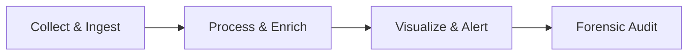

### 3. Multi-Cloud Telemetry Ingestion Hub
Normalizing logs, metrics, and traces from AWS, Azure, and GCP into a unified schema for consistent enterprise-wide observability.

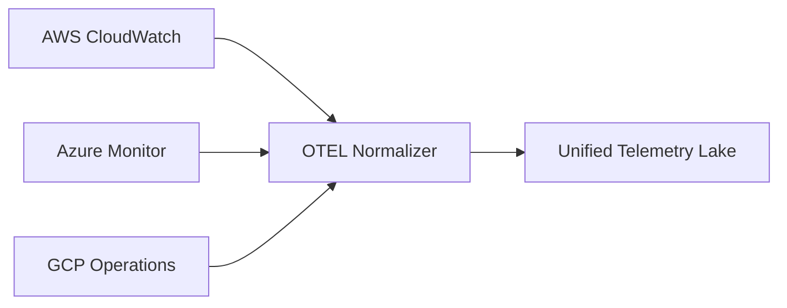

### 4. OpenTelemetry (Otel) Pipeline Architecture
The strategic orchestration of collectors, processors (sampling/masking), and exporters to manage the high-velocity flow of trace data.

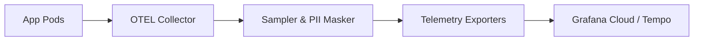

### 5. Distributed Tracing & Service Map Flow
Correlating spans across distributed microservices to visualize the request path and identify high-latency bottlenecks in the topology.

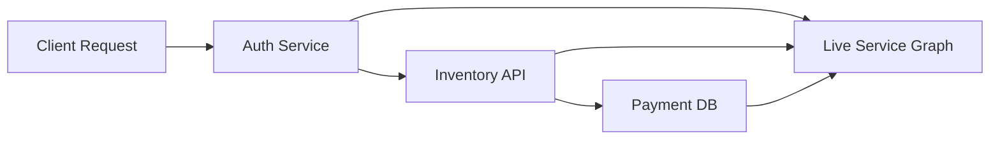

### 6. Real-time Alerting & Incident Response Hub
Orchestrating the correlation and deduplication of alerts to prevent "Alert Fatigue" and drive faster response through PagerDuty and Slack.

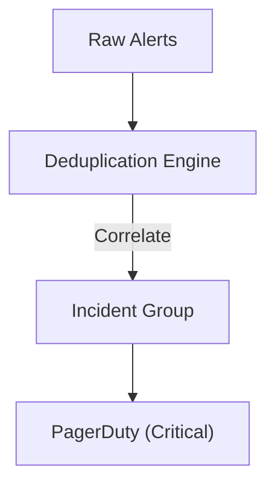

### 7. Institutional Observability Scorecard
Grading organizational services on key indicators: SLO/SLI Adherence, Error Budget Burn Rate, and MTTR Performance.

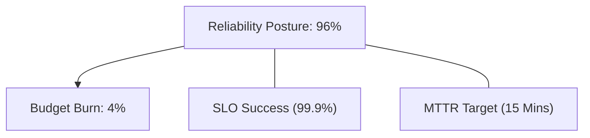

### 8. Identity & RBAC for Observability Ops
Managing fine-grained access to telemetry data and alerting controls between SREs, developers, and security auditors.

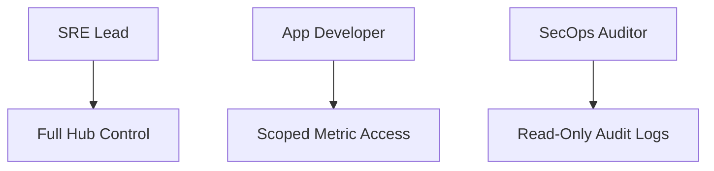

### 9. Data Retention & Lifecycle Management (Storage Tiers)
Automating the movement of high-volume telemetry from high-cost Hot storage to Warm and Cold archival tiers for compliance.

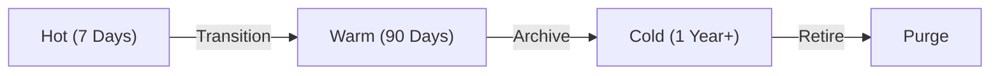

### 10. IaC Deployment: Observability-as-Code Framework
Using Terraform to deploy and manage the versioned distribution of the observability collectors, dashboards, and storage infrastructure.

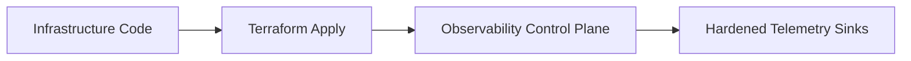

### 11. Metadata Lake for Forensic Observability Audit
Storing long-term records of every alert, metric snapshot, and incident resolution for institutional investigation and compliance.

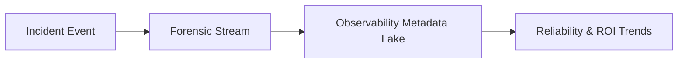

---

## 🏛️ Core Observability Pillars

1.  **Unified Signal Correlation**: Automatically linking metrics to traces and logs for rapid root-cause analysis.
2.  **OpenTelemetry Standard**: Utilizing the industry-standard for telemetry ingestion to avoid provider lock-in.
3.  **SLO-Driven Reliability**: Measuring system health against business-defined Service Level Objectives.
4.  **Cost-Aware Telemetry**: Optimizing ingestion and storage through intelligent sampling and tiering.
5.  **Proactive Anomaly Detection**: Identifying deviations from baselines before they impact customer experience.
6.  **Full Auditability**: Immutable recording of every alert and incident response for institutional record-keeping.

---

## 🛠️ Technical Stack & Implementation

### Observability Engine & APIs
*   **Framework**: Python 3.11+ / FastAPI.
*   **Ingestion Hub**: High-throughput Kafka-based consumers for telemetry normalization and buffering.
*   **Correlation Engine**: Custom logic for trace-log stitching and metric-to-signal mapping.
*   **SLO Manager**: Real-time error budget tracker and burn-rate alert orchestrator.
*   **State Management**: PostgreSQL (Metadata Lake) and Redis (Alert Cache).

### Observability Dashboard (UI)
*   **Framework**: React 18 / Vite.
*   **Theme**: Dark, Indigo, Violet (Modern SRE aesthetic).
*   **Visualization**: Recharts for reliability trajectories, error budget burn, and signal mix analysis.

### Infrastructure & DevOps
*   **Runtime**: AWS EKS or Azure Kubernetes Service (AKS).
*   **Telemetry Stack**: Grafana-native (Prometheus, Loki, Tempo).
*   **IaC**: Modular Terraform for deploying the observability hub and collector distributions.

---

## 🏗️ IaC Mapping (Module Structure)

| Module | Purpose | Real Services |
| :--- | :--- | :--- |
| **`infrastructure/hub`** | Central management plane | EKS, PostgreSQL, Redis |
| **`infrastructure/collectors`** | Distributed OTEL agents | EC2, Lambda, DaemonSets |
| **`infrastructure/storage`** | High-performance telemetry sinks | Prometheus, Loki, Tempo |
| **`infrastructure/auditing`** | Forensic observability sinks | S3, Athena, Quicksight |

---

## 🚀 Deployment Guide

### Local Principal Environment
```bash
# Clone the observability platform
git clone https://github.com/devopstrio/platform-observability-hub.git
cd platform-observability-hub

# Configure environment
cp .env.example .env

# Launch the Observability stack (Requires 8GB+ RAM)
make up

# Ingest mock telemetry data simulation
make ingest-mock
```

Access the Observability Dashboard at `http://localhost:3000`.

---

## 📜 License
Distributed under the MIT License. See `LICENSE` for more information.

---
<div align="center">
  <p>© 2026 Devopstrio. All rights reserved.</p>
</div>
