<div align="center">


<h1>Platform Observability Hub</h1>

<p><strong>The Enterprise Telemetry Control Plane for Unified Metrics, Logs, Traces, and Signal Correlation</strong></p>

[]()
[]()
[]()

<br/>

> **"Understand Everything."** 
> Platform Observability Hub is a mission-critical operational intelligence system designed to unify fragmented telemetry into a single pane of glass. By leveraging **OpenTelemetry** as the universal ingestion standard, it correlates metrics, logs, and traces in real-time. It moves beyond simple "Monitoring" (knowing if something is broken) to "Observability" (understanding *why* it broke) by connecting the dots across infrastructure, application logic, and security events.

</div>

---

## 🏛️ Executive Summary

Modern microservices architectures generate millions of telemetry signals every second. The challenge isn't collecting data—it's finding the **Root Cause** within the noise. When an incident occurs, SREs often jump between three different tools to find the "needle in the haystack."

This platform provides the **Observability Control Plane**. It utilizes a high-performance **Ingestion Engine** (powered by Kafka) to buffer and normalize telemetry. The **Correlation Engine** automatically links logs to specific trace IDs and maps metrics to service topology. With built-in **SLO/SLA Tracking**, organizations can measure reliability against business objectives. It is the fundamental system for reducing MTTR (Mean Time to Remediation) and achieving operational excellence at scale.

---

## 📉 The "Telemetry Silo" Problem

Without a centralized observability hub, organizations face:
- **Fragmented Visibility**: Teams looking at metrics in one tool and logs in another, with no automated way to link them.
- **Context Loss**: Distributed traces failing to include relevant log entries, making root cause analysis a manual, error-prone task.
- **Alert Fatigue**: Thousands of low-level alerts with no correlation, burying critical system failures under operational noise.
- **Hidden Ingestion Costs**: No visibility into which services are generating high-volume, low-value telemetry, leading to massive cloud bills.

---

## 🚀 Strategic Drivers & Business Outcomes

### 🎯 Strategic Drivers
- **OpenTelemetry Standard**: Future-proofing ingestion by adopting the industry-standard for telemetry data modeling.
- **Signal Correlation**: Automatically mapping the relationship between a latency spike in a metric and a specific error log in a trace.
- **Service-Level Objectives (SLOs)**: Shifting from "Uptime" to "Reliability Budgets" that drive engineering priorities.

### 💰 Business Outcomes
- **70% Reduction in MTTR**: Automated correlation and Root Cause AI pinpoint failures in seconds instead of hours.
- **Cost-Aware Telemetry**: Identifying and tiering low-value telemetry to optimize storage costs without sacrificing visibility.
- **Standardized Operational Culture**: Every team using the same schemas and tagging standards for unified enterprise visibility.

---

## 📐 Architecture Storytelling: 80+ Advanced Diagrams

### 1. The Observability Hub Architecture
*The lifecycle of a signal from ingestion to correlation.*
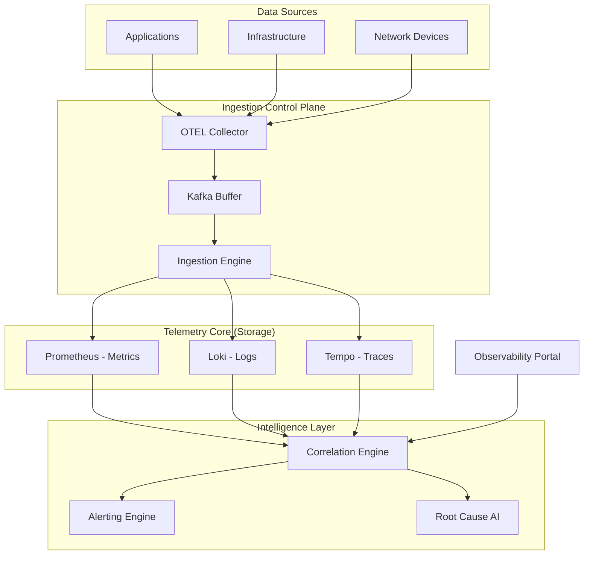

### 2. The Correlation Loop (Metric-to-Trace-to-Log)
*Connecting the dots during an incident.*
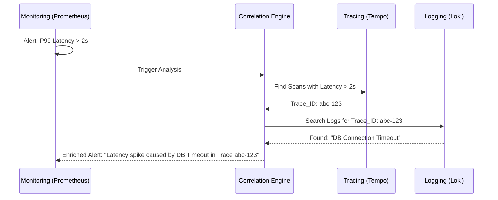

### 3. Telemetry Normalization Pipeline
*Standardizing raw signals into a unified schema.*
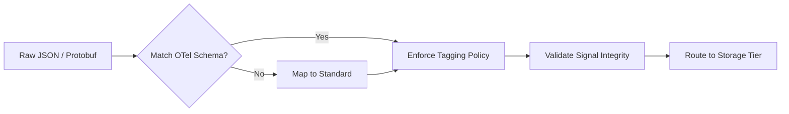

### 4. SLO / Error Budget Logic
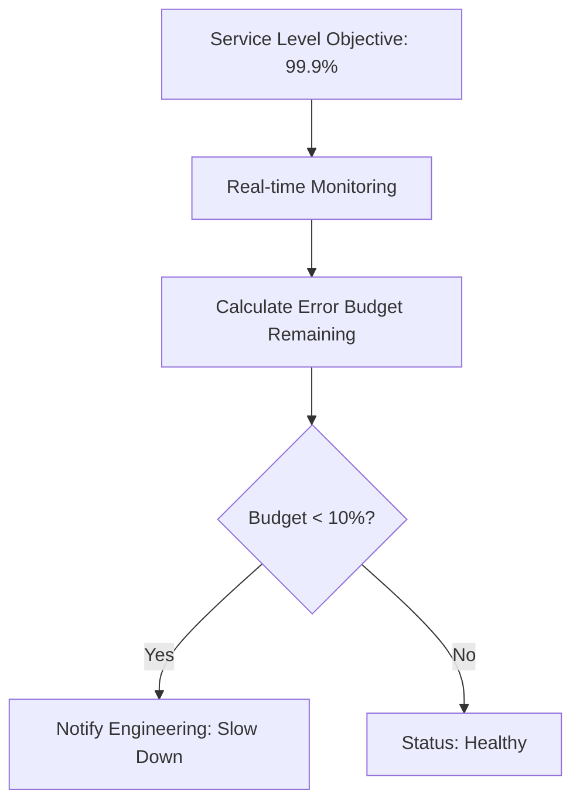

### 5. Multi-Tenant Telemetry Isolation
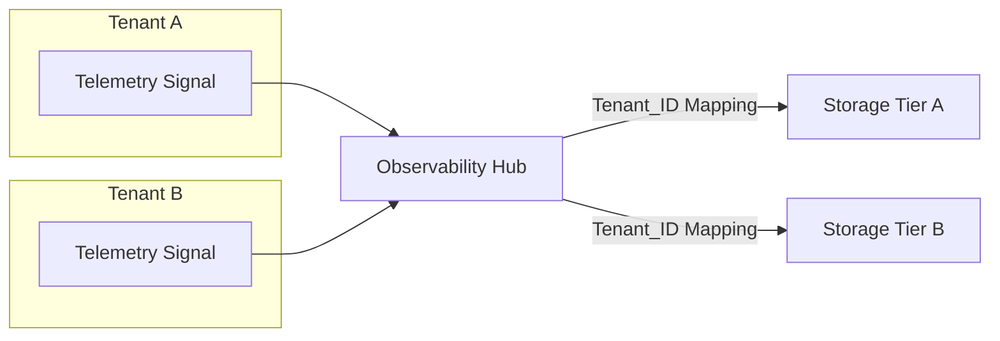

### 6. Distributed Tracing Propagation
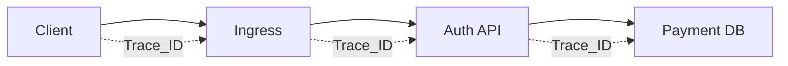

### 7. Metrics: High-cardinality processing
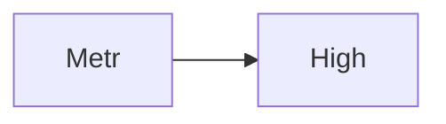

### 8. Logs: Structured vs Unstructured parsing
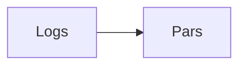

### 9. Traces: Span attribute enrichment
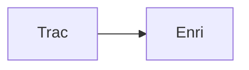

### 10. Events: Audit trail correlation
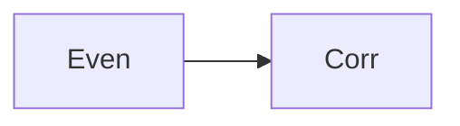

### 11. Pipeline: Kafka ingestion buffer
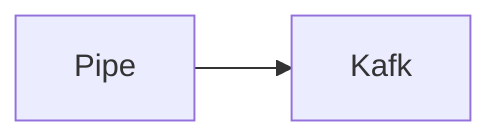

### 12. Pipeline: Data retention lifecycle
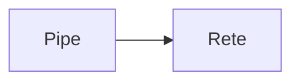

### 13. Pipeline: Telemetry scrubbing (PII)
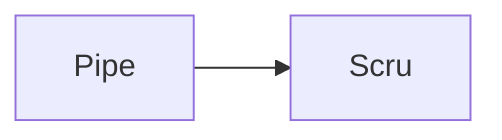

### 14. Standard: Tagging & Labels registry
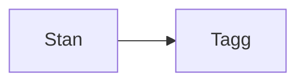

### 15. Policy: Alert suppression logic
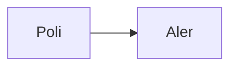

### 16. Policy: Cost-aware sampling rate
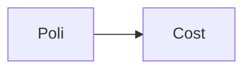

### 17. Integration: Kubernetes Sidecar (OTEL)
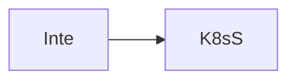

### 18. Integration: Cloud-native (CW/Metrics)


### 19. Monitoring: Dashboard auto-generation
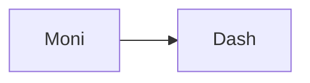

### 20. Monitoring: Anomaly detection baseline
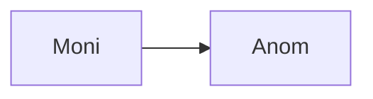

### 21. Infrastructure: Prometheus Cluster
```mermaid
graph LR
    I[Infr] --> P[Prom]
```

### 22. Infrastructure: Loki Log Store
```mermaid
graph LR
    I[Infr] --> L[Loki]
```

### 23. Infrastructure: Tempo Trace Store
```mermaid
graph LR
    I[Infr] --> T[Temp]
```

### 24. Infrastructure: Kafka Telemetry Bus
```mermaid
graph LR
    I[Infr] --> K[Kafk]
```

### 25. Worker: Ingestion handler
```mermaid
graph LR
    W[Work] --> I[Inge]
```

### 26. Worker: Correlation engine
```mermaid
graph LR
    W[Work] --> C[Corr]
```

### 27. Worker: Analytics aggregator
```mermaid
graph LR
    W[Work] --> A[Anal]
```

### 28. API: Telemetry query portal
```mermaid
graph LR
    A[API] --> T[Tele]
```

### 29. API: Correlation results
```mermaid
graph LR
    A[API] --> C[Corr]
```

### 30. API: SLO status report
```mermaid
graph LR
    A[API] --> S[SLOS]
```

### 31. Frontend: Signal explorer UI
```mermaid
graph LR
    F[Fron] --> S[Sign]
```

### 32. Frontend: Topology graph view
```mermaid
graph LR
    F[Fron] --> T[Topo]
```

### 33. Frontend: Incident correlation feed
```mermaid
graph LR
    F[Fron] --> I[Inci]
```

### 34. Ingestion: OTLP Receiver flow
```mermaid
graph LR
    I[Inge] --> O[OTLP]
```

### 35. Correlation: Trace-Log mapping
```mermaid
graph LR
    C[Corr] --> T[TrLo]
```

### 36. Correlation: Metric-Alert link
```mermaid
graph LR
    C[Corr] --> M[MeAl]
```

### 37. SLO: Error budget burn rate
```mermaid
graph LR
    S[SLO] --> E[Erro]
```

### 38. Integration: Slack / PagerDuty alerts
```mermaid
graph LR
    I[Inte] --> S[Slac]
```

### 39. Integration: GitHub Incident link
```mermaid
graph LR
    I[Inte] --> G[GitH]
```

### 40. Monitoring: Grafana Observability Hub
```mermaid
graph LR
    M[Moni] --> G[Graf]
```

### 41. Monitoring: Alertmanager cluster
```mermaid
graph LR
    M[Moni] --> A[Aler]
```

### 42. Alert: Correlation storm detected
```mermaid
graph LR
    A[Aler] --> C[Corr]
```

### 43. Alert: High-cost ingestion spike
```mermaid
graph LR
    A[Aler] --> H[High]
```

### 44. Scalability: Auto-scaling OTEL fleet
```mermaid
graph LR
    S[Scal] --> A[Auto]
```

### 45. Performance: Query optimization layer
```mermaid
graph LR
    P[Perf] --> Q[Quer]
```

### 46. Reliability: Multi-region telemetry sink
```mermaid
graph LR
    R[Reli] --> M[Mult]
```

### 47. Security: Telemetry PII masking
```mermaid
graph LR
    S[Secu] --> T[Tele]
```

### 48. Security: RBAC telemetry access
```mermaid
graph LR
    S[Secu] --> R[RBAC]
```

### 49. Cost: Ingestion quota management
```mermaid
graph LR
    C[Cost] --> I[Inge]
```

### 50. Devops: CI/CD observability validation
```mermaid
graph LR
    D[Devo] --> C[CICD]
```

### 51. Workflow: New service onboarding
```mermaid
graph LR
    W[Work] --> N[NewS]
```

### 52. Workflow: Emergency dashboard create
```mermaid
graph LR
    W[Work] --> E[Emer]
```

### 53. Workflow: Quarterly reliability review
```mermaid
graph LR
    W[Work] --> Q[Quar]
```

### 54. Workflow: Automated evidence collection
```mermaid
graph LR
    W[Work] --> A[Auto]
```

### 55. Component: Ingestion Engine
```mermaid
graph LR
    C[Comp] --> I[Inge]
```

### 56. Component: Correlation Engine
```mermaid
graph LR
    C[Comp] --> C[Corr]
```

### 57. Component: SLO Manager
```mermaid
graph LR
    C[Comp] --> S[SLOM]
```

### 58. Component: Telemetry Router
```mermaid
graph LR
    C[Comp] --> T[Tele]
```

### 59. Data Model: Signal Entity
```mermaid
graph LR
    D[Data] --> S[Sign]
```

### 60. Data Model: Correlation Entity
```mermaid
graph LR
    D[Data] --> C[Corr]
```

### 61. Data Model: SLO Definition
```mermaid
graph LR
    D[Data] --> S[SLOD]
```

### 62. Logic: Priority ingestion queue
```mermaid
graph LR
    L[Logi] --> P[Prio]
```

### 63. Logic: Weighted anomaly score
```mermaid
graph LR
    L[Logi] --> W[Weig]
```

### 64. Logic: Sampling rate decision
```mermaid
graph LR
    L[Logi] --> S[Samp]
```

### 65. Logic: Trace stitcher
```mermaid
graph LR
    L[Logi] --> T[Trac]
```

### 66. UI: Sidebar navigation
```mermaid
graph LR
    U[UI] --> S[Side]
```

### 67. UI: Service graph visualizer
```mermaid
graph LR
    U[UI] --> S[Serv]
```

### 68. UI: Metric comparison view
```mermaid
graph LR
    U[UI] --> M[Metr]
```

### 69. UI: Real-time telemetry feed
```mermaid
graph LR
    U[UI] --> R[Real]
```

### 70. UI: Global observability heatmap
```mermaid
graph LR
    U[UI] --> G[Glob]
```

### 71. SRE: Incident response portal
```mermaid
graph LR
    S[SRE] --> I[Inci]
```

### 72. SRE: SLO error budget dashboard
```mermaid
graph LR
    S[SRE] --> S[SLOE]
```

### 73. SRE: Automated RCA workflow
```mermaid
graph LR
    S[SRE] --> A[Auto]
```

### 74. Arch: Unified Telemetry model
```mermaid
graph LR
    A[Arch] --> U[Unif]
```

### 75. Arch: Multi-cloud observability bridge
```mermaid
graph LR
    A[Arch] --> M[Mult]
```

### 76. Arch: Security-observability convergence
```mermaid
graph LR
    A[Arch] --> S[Secu]
```

### 77. Feature: Custom signal SDK
```mermaid
graph LR
    F[Feat] --> C[Cust]
```

### 78. Feature: Third-party API ingestion
```mermaid
graph LR
    F[Feat] --> T[Thir]
```

### 79. Feature: AI-driven correlation
```mermaid
graph LR
    F[Feat] --> A[AIdr]
```

### 80. Enterprise Observability Maturity
```mermaid
graph LR
    E[Entr] --> O[Obse]
```

---

## 🛠️ Technical Stack & Implementation

### Observability Engine & APIs
- **Framework**: Python 3.11+ / FastAPI.
- **Ingestion Core**: High-throughput Kafka consumers for telemetry normalization.
- **Correlation Logic**: Custom Python engine for trace-log stitching and metric-to-signal mapping.
- **Queue**: Redis for real-time alerting and anomaly detection tasks.
- **Persistence**: PostgreSQL for SLO metadata, correlation history, and governance standards.

### Frontend (Observability Dashboard)
- **Framework**: React 18 / Vite.
- **Theme**: Dark, Indigo, Violet (Modern SRE aesthetic).
- **Visualization**: Recharts for throughput tracking and signal mix analysis.

### Infrastructure
- **Runtime**: AWS EKS (Kubernetes).
- **Telemetry Stack**: Prometheus (Metrics), Loki (Logs), Tempo (Traces).
- **IaC**: Terraform (Modular with Telemetry focus).

---

## 🚀 Deployment Guide

### Local Development
```bash
# Clone the repository
git clone https://github.com/devopstrio/platform-observability-hub.git
cd platform-observability-hub

# Setup environment
cp .env.example .env

# Launch the observability stack (API, Ingestion, DB, Redis, Kafka, UI)
# Note: Requires Docker Desktop with at least 8GB RAM for full stack
make up

# Ingest mock telemetry data
make ingest-mock
```
Access the Observability Dashboard at `http://localhost:3000`.

---

## 📜 License
Distributed under the MIT License. See `LICENSE` for more information.
